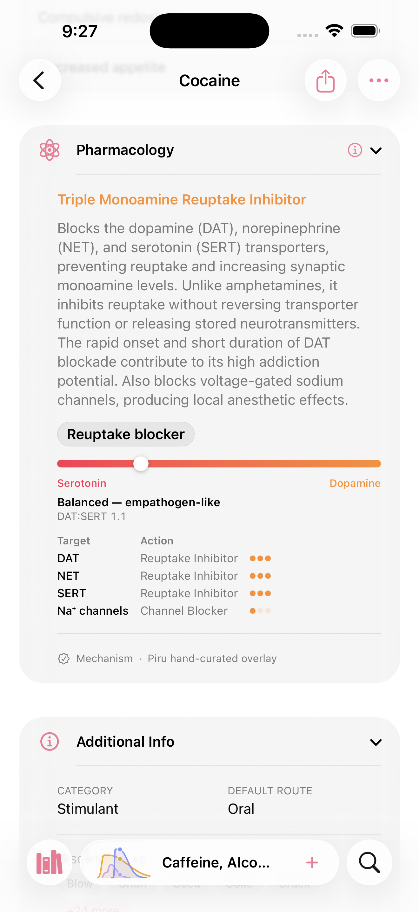
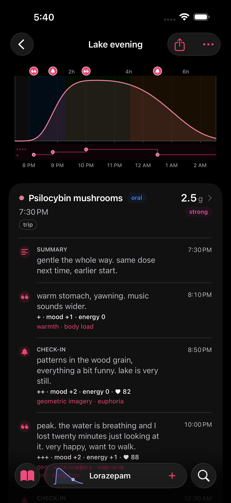
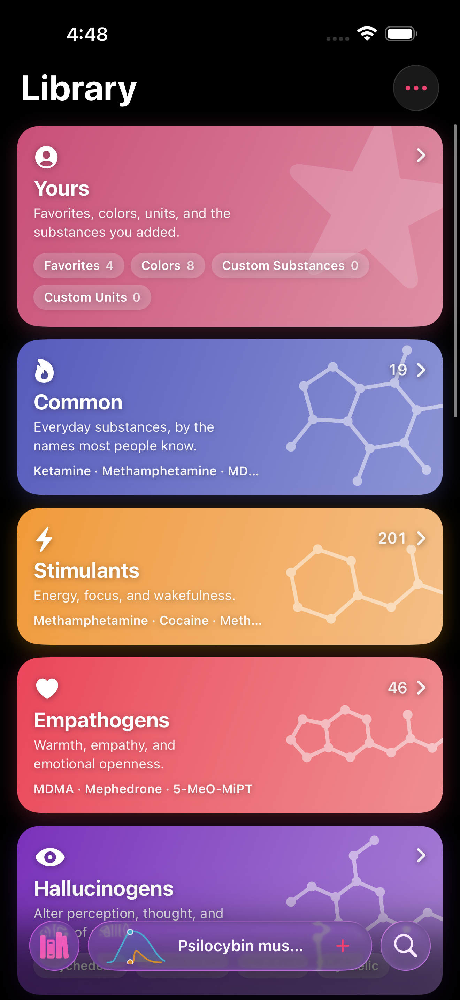
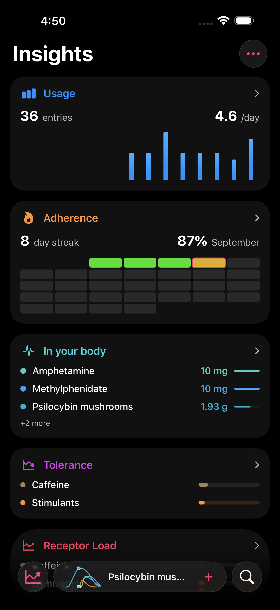
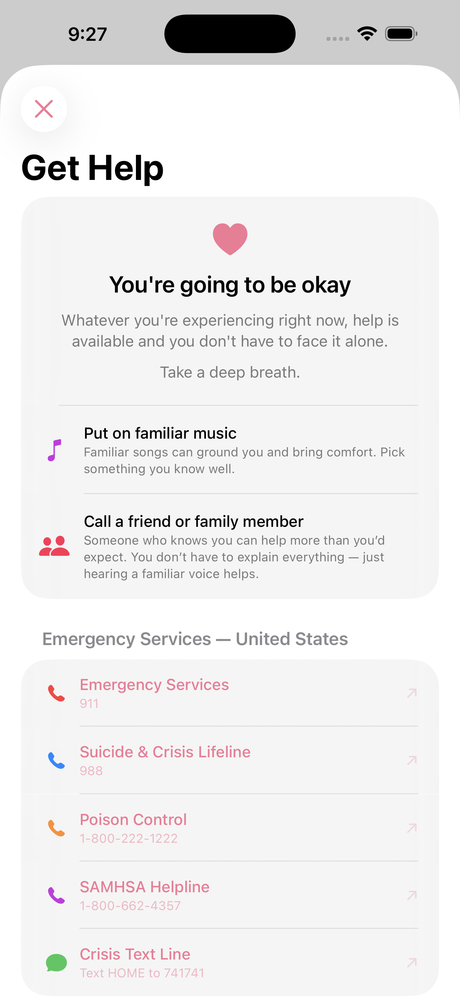
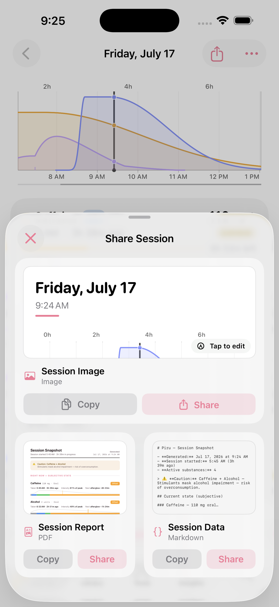

<a href="README.md">English</a> ・ <a href="README.zh-Hans.md">简体中文</a>

# piru

**rx no. 007 ・ pi·ru ・ a dose journal and a pharmacopeia ♡**

<table>
  <tr>
    <td align="center"> <b>the journal</b> ・ what you took, drawn as it rises and clears</td>
    <td align="center"> <b>the pharmacopeia</b> ・ mechanism, binding, and citations for 1,900+ substances</td>
  </tr>
</table>

> **服用注意 ・ a dose is not a confession.**
>
> Most tracking apps are built to make you take less. Piru isn't. It assumes you already know what
> you're doing and just want to *see* it — what you took, when, and what it's still doing to you
> right now — so it keeps a clean ledger and draws the pharmacology over it: the curve rising and
> clearing, the second dose stacking on the first, the interaction window opening. It's a question
> of dose, not of goodness. ♡

---

Piru is an iOS dose journal and pharmacology reference for anyone who takes things — prescriptions,
supplements, or recreational substances. Log a dose in two taps and Piru draws the pharmacokinetics
over your day: what's still active, what stacks into a dangerous pair, how tolerance builds and
fades. Everything stays on your device.

## Get the beta

Piru ships through **TestFlight**, Apple's beta app. Two-minute setup:

1. Tap the invite link: **[testflight.apple.com/join/4vcA7dY3](https://testflight.apple.com/join/4vcA7dY3)**
2. Under **Step 1 – Get TestFlight**, tap **View in App Store** and install TestFlight (skip if you already have it).
3. Back on the invite page, under **Step 2 – View Piru Beta**, tap **View in TestFlight**.
4. TestFlight opens the Piru page — tap **Install**.
5. When it's done, tap **Open**, or launch Piru from your home screen.

That's it. New builds arrive as a notification, and updating is one tap inside TestFlight.

Questions, bug reports, or just want to hang out? **[Join the Discord →](https://discord.gg/hbpMZhPSdx)**

## Features

- **A journal that draws itself.** Every dose becomes a pharmacokinetic curve. Doses within a window
  group into **sessions**, and the session graph overlays each substance so you can read the whole
  night at a glance — what's peaking, what's fading, what's about to come back around.
- **1,900+ substances, cited.** Dose ladders (threshold → light → common → strong → heavy), routes,
  onset/peak/offset durations, half-lives, mechanism of action, receptor binding, and subjective
  effects — resolved per-field from **17 data sources** and linked back to each one.
- **Interaction warnings.** Class-based danger rules (MAOI + stimulant, opioid + depressant, serotonergic
  stacks, and more) surface inline as you log and paint a danger window onto the timeline.
- **Tolerance & effect forecasting.** A tolerance model tracks how sensitivity builds and recovers;
  for stimulants and cathinones a calibrated pharmacodynamic engine forecasts how the session will
  *feel* — its rush, its plateau, its crash. See [below](#where-piru-is-different).
- **Adjustable depth.** Choose **Casual**, **Curious**, or **Pharma Nerd** and the whole app dials in
  to match — from plain dose ladders and top-line warnings up to receptor-binding tables, biased
  agonism, and CYP metabolism with citations down to the DOI.
- **A toolbox.** Half-life calculator, volumetric dosing, benzodiazepine and opioid equivalence
  converters, inventory tracking, and an interaction checker.
- **Live Activity & widgets.** Active doses on the Lock Screen and Dynamic Island with time remaining;
  Home Screen widgets for the current session and last dose.
- **Insights.** Usage trends, an adherence calendar, a per-substance tolerance readout, and a live
  "in your system" estimate.
- **Share a session.** Export the current state of your body as a clean image, a PDF report with the
  PK charts, or a Markdown summary — for a doctor, a friend, or your own notes.

## Where Piru is different

Most dose trackers draw one generic bell curve for everything. Piru models three things they don't.

### It predicts how a stimulant will feel — *when*, not how much

For **amphetamine, methylphenidate, and the cathinones (2-/3-/4-MMC)**, Piru runs a real
pharmacodynamic model instead of a stored curve. It treats what you *feel* as the gap between the
dopamine a dose forces and how fast your brain compensates for it — and the whole shape falls out of
that one idea. The same drug gives a rush intravenously but barely orally, because the rush tracks
how *fast* dopamine rises, not how high it peaks. Euphoria fades on a plateau as your brain catches
up, until residual drug feels like nothing. The comedown gets deeper with a bigger dose, then curves
back toward baseline — and it isn't a dopamine dip but an over-correction: the brake still clamped
down after dopamine has already returned to normal.

The model is calibrated on human PET and primate microdialysis, not eyeballed — **Breier et al.
(PNAS 1997)** for the dopamine-to-effect transfer function, **Volkow (2001, 2023)** for the rate
hypothesis, and **Kuczenski & Segal (1997)** for the releaser-vs-blocker split that makes amphetamine
hit harder and crash worse than methylphenidate. It forecasts **shape and sign, not milligrams** —
when the effect lands, when it fades, when the crash arrives. Any substance the model can't ground
falls back to the standard curve.

### Your heart rate, mapped to each dose

Connect Apple Health and Piru overlays your **heart rate and blood pressure** right on the session
timeline — then reads how your body answered *each* dose: the resting rate before it, the peak after,
and the delta. Read-only, and the numbers never leave your device.

### Alcohol, modeled the way it clears

Alcohol doesn't decay like everything else. Its clearing enzyme saturates almost immediately, so it
comes off at a **constant grams-per-hour** — *zero-order* elimination — which means **duration scales
with the dose** and the decline is a straight line, not the usual exponential tail. Enter a drink by
**volume × ABV** and Piru draws it correctly:

<table>
  <tr>
    <td align="center"> <b>a beer</b> ・ 330 mL · 5% → 13 g · clears in ~2 h</td>
    <td align="center"> <b>a bottle of whiskey</b> ・ 700 mL · 40% → 221 g · ~34 h, ruler-straight</td>
  </tr>
</table>

Seventeen times the ethanol takes roughly seventeen times as long to clear — the curve just gets
wider, not taller-and-shorter. And because elimination tracks liver and body mass, Piru scales it by
**your body weight**: the *same* bottle clears far faster in a larger body.

<table>
  <tr>
    <td align="center"> <b>at 60 kg</b> ・ ~34 h to clear</td>
    <td align="center"> <b>at 100 kg</b> ・ same bottle, ~20 h</td>
  </tr>
</table>

## The library — 1,900+ substances, every claim cited

Piru bundles an offline SQLite library of **1,900+ substances**. Each field — a dose range, a duration,
a receptor affinity, a mechanism summary — is resolved by **source priority** (which you can reorder)
and carries its own attribution, so a substance sheet ends with a **Data Sources** list that links
straight to each source's page for that compound. Doses and durations come first from
**[drug.community](https://drug.community)** — a dataset curated by a former pharma-industry contributor
and cross-checked in-app — with the volunteer wikis backfilling anything it doesn't cover. Which source
wins a given field, in priority order:

- **Piru's own hand-curated overlay** & **peer-reviewed primary literature** — outrank everything, so a
  verified correction always wins (this is also where genuine upstream dose bugs get overridden)
- **[drug.community](https://drug.community)** — **preferred** dose/duration ladders & reported-effect spectra
- **[PsychonautWiki](https://psychonautwiki.org)** & **[TripSit](https://tripsit.me)** — backfill dose ranges
  and durations, plus effect vocabulary, interaction data, and harm-reduction dosing
- **[FreeODwiki](https://github.com/SalviaSWC/FreeODwiki)** — the substance-profile copy for the **Chinese
  locale** (读中文时的正文来源)
- **[DailyMed](https://dailymed.nlm.nih.gov)** (FDA) & **DEA Orange Book** — prescription labels & scheduling
- **[PubChem](https://pubchem.ncbi.nlm.nih.gov)** & **[Wikidata](https://www.wikidata.org)** — identifiers, chemistry
- **[PDSP Ki database](https://pdsp.unc.edu)** — receptor binding affinities
- **Erowid PiHKAL/TiHKAL** and other primary literature for the rest

## Reads in your language

Piru ships a **full localization in English, Simplified Chinese (简体中文), and Traditional Chinese
(繁體中文)** — not just the interface chrome, but the pharmacology summaries, effect names, and safety
copy. Crisis resources are **region-aware**: the *Get Help* screen shows the emergency and crisis
lines for where you actually are.

<table>
  <tr>
    <td align="center"> 日志 ・ the journal, localized</td>
    <td align="center"> 药理学 ・ the pharmacology, in full</td>
    <td align="center"> 获取帮助 ・ region-aware crisis lines</td>
  </tr>
</table>

## A closer look

<table>
  <tr>
    <td align="center"> <b>session detail</b> ・ every dose, still ticking</td>
    <td align="center"> <b>library</b> ・ browse by effect class</td>
    <td align="center"> <b>insights</b> ・ usage, adherence, tolerance</td>
  </tr>
  <tr>
    <td align="center"> <b>tools</b> ・ calculators, converters, inventory</td>
    <td align="center"> <b>get help</b> ・ one tap away, always</td>
    <td align="center"> <b>share</b> ・ image, PDF, or Markdown</td>
  </tr>
</table>

## Private by design

Piru is built for sensitive data, so the default is the safe one: **nothing leaves your device.**

- **On-device only.** Your journal lives locally in SwiftData. No sign-up, no account, no server.
- **No cloud unless you ask.** Backups are opt-in and **end-to-end encrypted** (AES-256-GCM) with a
  device key held in your iCloud Keychain, or a passphrase only you know.
- **No ads, no trackers, no analytics selling.** Your data is yours alone.

## Requirements

- **iOS 26 or later.** The interface is built around Liquid Glass; earlier iOS is not supported.
- **Xcode 26+** with Swift 6 to build — clone, open `Piru.xcodeproj`, and Run.
- Distributed via [TestFlight](https://testflight.apple.com/join/4vcA7dY3), not the App Store — see [Get the beta](#get-the-beta).

The bundled substance library is built by an offline, reproducible Python pipeline from committed
source snapshots — see [`pipeline/`](pipeline/). Never hand-edit `Piru/Data/piru-substances.sqlite`;
rebuild it with `pipeline/build.sh`.

## The name

**Piru** (ピル) is Japanese for *pill* — hence the smiling capsule. The name and mascot are inherited
from the app's original author, [pharmacykitty](https://github.com/pharmacykitty). It keeps its shelf
among the other prescriptions at [kagerou.glass](https://kagerou.glass) — **rx no. 007**, the one you
reach for to remember what you took.

## License

Piru is free software under the **GNU General Public License v3** — see [LICENSE](LICENSE).

## Acknowledgements

Originally built by [pharmacykitty](https://github.com/pharmacykitty); continued by
[@kageroumado](https://x.com/kageroumado), dispensed at [kagerou.glass](https://kagerou.glass).
Pharmacology data courtesy of [FreeODwiki](https://github.com/SalviaSWC/FreeODwiki),
[PsychonautWiki](https://psychonautwiki.org), [TripSit](https://tripsit.me), the NIH's
[DailyMed](https://dailymed.nlm.nih.gov), [PubChem](https://pubchem.ncbi.nlm.nih.gov), the
[PDSP Ki database](https://pdsp.unc.edu), and the peer-reviewed literature cited throughout the app.

> **服用注意 ・ Piru is not medical advice.** It will not stop you from making a bad decision, and its
> models are estimates, not measurements. Get a test kit, dose low, and keep a sober friend. ♡
