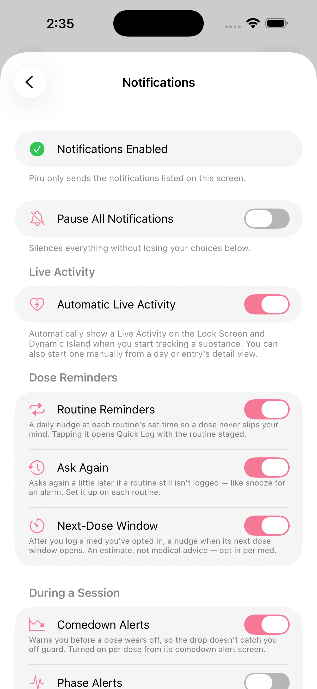
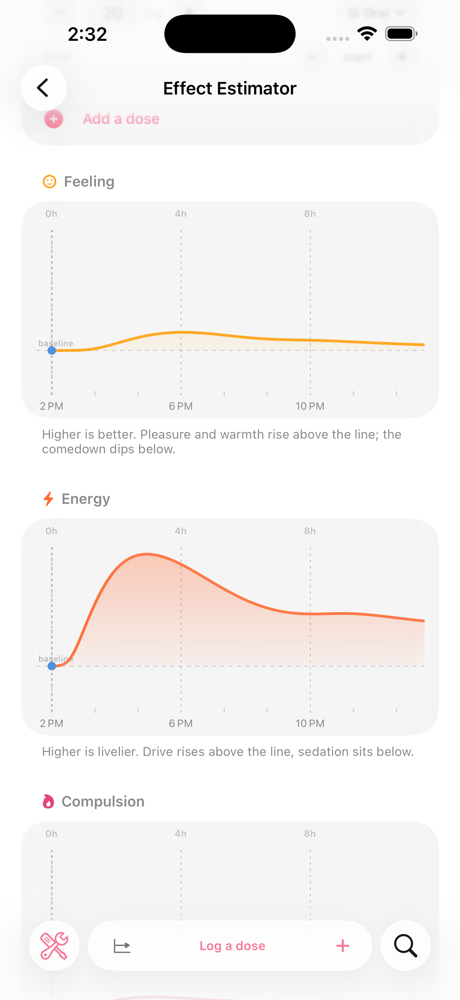
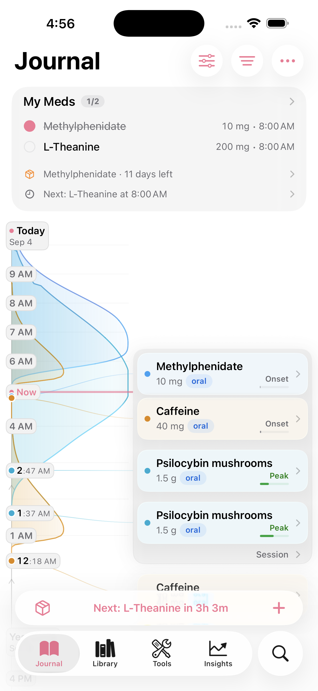
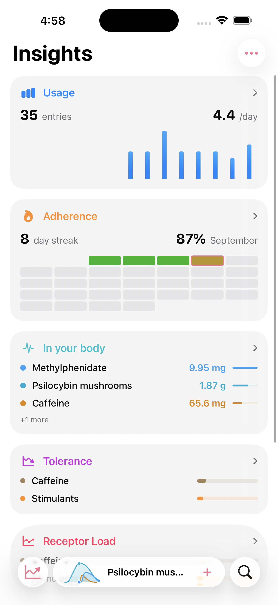

<a href="README.md">English</a> ・ <a href="README.zh-Hans.md">简体中文</a>

# piru

**rx no. 007 ・ pi·ru ・ a dose journal and a pharmacopeia ♡**

<table>
  <tr>
    <td align="center"> <b>the journal</b> ・ what you took, drawn as it rises and clears</td>
    <td align="center"> <b>the pharmacopeia</b> ・ mechanism, binding, and citations for 1,700+ substances</td>
  </tr>
</table>

> **服用注意 ・ a dose is not a confession.**
>
> Most tracking apps are built to make you take less. Piru isn't. It assumes you already know what
> you're doing and just want to *see* it — what you took, when, and what it's still doing to you
> right now. It's a question of dose, not of goodness. ♡

---

Log a dose in two taps. Piru draws the pharmacokinetics over your day: what's still active, what
stacks into a dangerous pair, how tolerance builds and fades. 1,700+ substances, each field cited
to its source. Everything stays on your device.

## Get the beta

Piru ships through **TestFlight**, Apple's beta app. Two-minute setup:

1. Tap the invite link: **[testflight.apple.com/join/4vcA7dY3](https://testflight.apple.com/join/4vcA7dY3)**
2. Under **Step 1 – Get TestFlight**, tap **View in App Store** and install TestFlight (skip if you already have it).
3. Back on the invite page, under **Step 2 – View Piru Beta**, tap **View in TestFlight**.
4. TestFlight opens the Piru page — tap **Install**.
5. When it's done, tap **Open**, or launch Piru from your home screen.

Questions, bug reports, or just want to hang out? **[Join the Discord →](https://discord.gg/hbpMZhPSdx)**

## Where Piru is different

Most dose trackers draw one generic bell curve for everything. Piru models three things they don't.

### It predicts how a stimulant will feel

For **amphetamine, methylphenidate, and the cathinones**, Piru runs a pharmacodynamic model: what
you *feel* is the gap between the dopamine a dose forces and how fast your brain compensates. The
same drug gives a rush intravenously but barely orally, because the rush tracks how *fast* dopamine
rises, not how high. Euphoria fades on a plateau as the brain catches up; the comedown is an
over-correction — the brake still clamped after dopamine has already returned to normal.

Calibrated on human PET and primate microdialysis — **Breier et al. (PNAS 1997)**, **Volkow (2001,
2023)**, **Kuczenski & Segal (1997)**. It forecasts **shape and sign** — when the effect lands, when
it fades, when the crash arrives. Substances the model can't ground fall back to the standard curve.

### Your heart rate, mapped to each dose

Connect Apple Health and Piru overlays your **heart rate and blood pressure** on the session
timeline — the resting rate before each dose, the peak after, and the delta.

### Alcohol, modeled the way it clears

Alcohol's clearing enzyme saturates almost immediately, so it comes off at a **constant
grams-per-hour** — *zero-order* elimination. Duration scales with the dose; the decline is a
straight line. Enter a drink by **volume × ABV** and Piru draws it correctly:

<table>
  <tr>
    <td align="center"> <b>a beer</b> ・ 330 mL · 5% → 13 g · clears in ~2 h</td>
    <td align="center"> <b>a bottle of whiskey</b> ・ 700 mL · 40% → 221 g · ~34 h, ruler-straight</td>
  </tr>
</table>

Seventeen times the ethanol takes roughly seventeen times as long to clear. And because elimination
tracks liver and body mass, Piru scales it by **your body weight**:

<table>
  <tr>
    <td align="center"> <b>at 60 kg</b> ・ ~34 h to clear</td>
    <td align="center"> <b>at 100 kg</b> ・ same bottle, ~20 h</td>
  </tr>
</table>

## More than a logger

<table>
  <tr>
    <td align="center"> <b>log the pill, not the milligram</b> ・ pick a brand like <b>Concerta</b> and Piru offers its real tablet strengths — 18 / 27 / 36 / 54 mg — and counts by the tablet</td>
    <td align="center"> <b>prescriptions & routines</b> ・ group daily meds, give them a time, and a reminder opens Quick Log pre-filled — with supplies that count down to a refill</td>
  </tr>
  <tr>
    <td align="center"> <b>reminders that fit the dose</b> ・ routine nudges, next-dose windows, comedown alerts, and quiet hours — every type opt-in</td>
    <td align="center"> <b>the effect estimator</b> ・ compare two meds or preview a stack — watch how it might <i>feel</i> over the hours, without logging a thing</td>
  </tr>
</table>

## The library — 1,700+ substances, every claim cited

An offline SQLite library where each field — a dose range, a duration, a receptor affinity, a
mechanism summary — is resolved by **source priority** (which you can reorder) and carries its own
attribution. Doses and durations come first from **[drug.community](https://drug.community)**, with
the volunteer wikis backfilling. The full priority chain:

**Piru curated overlay** & **primary literature** → **[drug.community](https://drug.community)** →
**[PsychonautWiki](https://psychonautwiki.org)** & **[TripSit](https://tripsit.me)** →
**[FreeODwiki](https://github.com/SalviaSWC/FreeODwiki)** (中文正文来源) →
**[DailyMed](https://dailymed.nlm.nih.gov)** & **DEA Orange Book** →
**[PubChem](https://pubchem.ncbi.nlm.nih.gov)** & **[Wikidata](https://www.wikidata.org)** →
**[PDSP Ki](https://pdsp.unc.edu)** →
**[SubFxOnEx](https://github.com/Di-lemma/SubFxOnEx)** (subjective-effects ontology) →
**Erowid PiHKAL/TiHKAL** and the rest

## A closer look

<table>
  <tr>
    <td align="center"> <b>journal</b> ・ dark</td>
    <td align="center"> <b>journal</b> ・ light</td>
  </tr>
</table>

<table>
  <tr>
    <td align="center"> <b>session notes</b> ・ check-ins with mood, energy, Shulgin scale, and effect descriptors</td>
    <td align="center"> <b>library</b> ・ browse by category</td>
    <td align="center"> <b>tools</b> ・ inventory, interactions, calculators</td>
  </tr>
</table>

<table>
  <tr>
    <td align="center"> <b>insights</b> ・ dark</td>
    <td align="center"> <b>insights</b> ・ light</td>
  </tr>
</table>

## Reads in your language

Full localization in **English, Simplified Chinese (简体中文), and Traditional Chinese (繁體中文)** —
not just the interface, but pharmacology summaries, effect names, and safety copy. Crisis resources
are **region-aware**: the *Get Help* screen shows the lines for where you actually are.

<table>
  <tr>
    <td align="center"> 日志 ・ the journal, localized</td>
    <td align="center"> 药理学 ・ the pharmacology, in full</td>
    <td align="center"> 获取帮助 ・ region-aware crisis lines</td>
  </tr>
</table>

## Private by design

**Nothing leaves your device.**

- **On-device only.** Your journal lives locally in SwiftData. No sign-up, no account, no server.
- **No cloud unless you ask.** Backups are opt-in and **end-to-end encrypted** (AES-256-GCM) with a
  device key held in your iCloud Keychain, or a passphrase only you know.
- **No ads, no trackers, no analytics.**

## Requirements

- **iOS 26 or later.** The interface is built around Liquid Glass; earlier iOS is not supported.
- **Xcode 26+** with Swift 6 to build — clone, open `Piru.xcodeproj`, and Run.
- Distributed via [TestFlight](https://testflight.apple.com/join/4vcA7dY3), not the App Store — see [Get the beta](#get-the-beta).

The bundled substance library is built by an offline, reproducible Python pipeline from committed
source snapshots — see [`pipeline/`](pipeline/). Never hand-edit `Piru/Data/piru-substances.sqlite`;
rebuild it with `pipeline/build.sh`.

## The name

**Piru** (ピル) is Japanese for *pill* — hence the smiling capsule. The name and mascot are inherited
from the app's original author, [pharmacykitty](https://github.com/pharmacykitty). It keeps its shelf
among the other prescriptions at [kagerou.glass](https://kagerou.glass) — **rx no. 007**, the one you
reach for to remember what you took.

## License

Piru is free software under the **GNU General Public License v3** — see [LICENSE](LICENSE).

## Acknowledgements

Originally built by [pharmacykitty](https://github.com/pharmacykitty); continued by
[@kageroumado](https://x.com/kageroumado), dispensed at [kagerou.glass](https://kagerou.glass).
Pharmacology data courtesy of [FreeODwiki](https://github.com/SalviaSWC/FreeODwiki),
[PsychonautWiki](https://psychonautwiki.org), [TripSit](https://tripsit.me), the NIH's
[DailyMed](https://dailymed.nlm.nih.gov), [PubChem](https://pubchem.ncbi.nlm.nih.gov), the
[PDSP Ki database](https://pdsp.unc.edu), and the peer-reviewed literature cited throughout the app.

> **服用注意 ・ Piru is not medical advice.** It will not stop you from making a bad decision, and its
> models are estimates, not measurements. Get a test kit, dose low, and keep a sober friend. ♡
