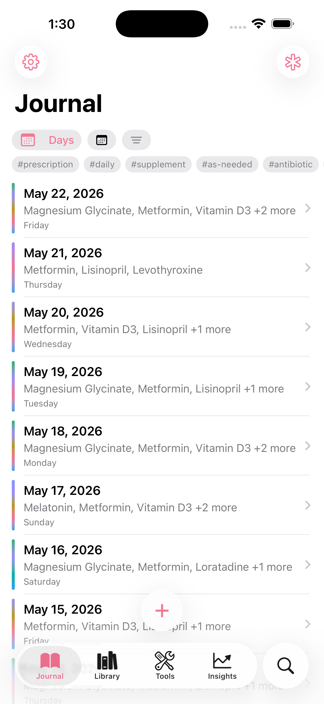
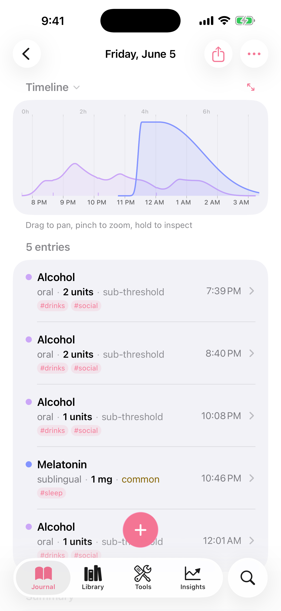

# Piru

A substance dose tracker for iOS. Logs what you took, when, and at what
dose; overlays pharmacokinetic curves so you can see what's still active;
warns about drug interactions before you stack them.

<p align="center">
  
  
</p>

Built primarily for harm reduction: medication adherence, recreational
session tracking, and stack safety. Substance data is sourced from
[TripSit][tripsit], [PsychonautWiki][pw], and the FDA's
[DailyMed][dailymed] — merged and deduplicated into a single library of
~1,100 substances with dose ranges, routes, durations, and half-lives.

[tripsit]: https://tripsit.me
[pw]: https://psychonautwiki.org
[dailymed]: https://dailymed.nlm.nih.gov

## Features

- **~1,100 substances** with dose ranges (threshold / light / common /
  strong / heavy), administration routes, duration profiles, and
  half-lives.
- **Pharmacokinetic timeline.** A one-compartment oral PK model
  estimates absorption rate from each route's onset and renders the
  resulting concentration curve; doses scale the curve height by
  amount-to-heavy ratio.
- **Interaction warnings.** 59 class-based interaction rules covering
  the common danger pairs (MAOI + stimulant, opioid + benzo, lithium +
  NSAID, etc.). Warnings appear inline during logging and as a danger
  window on the timeline.
- **Live Activity.** Active doses appear on the Lock Screen and in the
  Dynamic Island with their remaining duration.
- **Harm-reduction notifications.** Optional ramp-down reminders
  grouped into 6-hour sessions, so back-to-back doses don't fragment
  into separate alert chains.
- **Daily medication tracking.** Prescription / supplement adherence
  with weekday-aware reminders, separate from the recreational journal.
- **Insights.** Activity heatmap, usage stats, half-life calculator,
  per-substance trend charts.
- **Custom substances.** Add anything not in the merged library — name,
  category, dose ranges, route, half-life — and it participates in
  search, interactions, and PK.
- **Export.** PsyLog-compatible JSON and PDF reports with PK charts.

## Requirements

- **iOS 26 or later.** The UI is built around Liquid Glass; older iOS
  versions are not supported.
- **Xcode 26 or later** with Swift 6.
- Apple developer account for code signing (TestFlight only; not on the
  App Store).

## Building

```bash
git clone https://github.com/kageroumado/piru.git
cd piru
open Piru.xcodeproj
```

Select the **Piru** scheme and Run. Code signing is configured for the
original developer team; set your own `DEVELOPMENT_TEAM` and bundle
identifiers in Xcode's signing settings before building to a device.

For a headless compile check:

```bash
xcodebuild -scheme Piru \
  -destination 'platform=iOS Simulator,name=iPhone 17 Pro' \
  build
```

To run the test suite (Apple Testing framework):

```bash
xcodebuild -scheme Piru \
  -destination 'platform=iOS Simulator,name=iPhone 17 Pro' \
  test
```

There is also a Swift Package Manager CLI in `Tools/SubstanceValidator`
that cross-checks the merged substance library against the upstream
APIs; useful when refreshing the cache.

```bash
cd Tools/SubstanceValidator
swift run SubstanceValidator validate
```

## Architecture

```
Piru/
├── Models/                 Substance, DoseRange, DurationProfile, units
├── Views/                  SwiftUI tabs: Journal, Library, Tools, Insights
├── Data/                   SubstanceLibrary, HalfLifeDatabase, Interactions
├── Services/               TripSit, PsychonautWiki, DailyMed API clients
└── Utilities/              PKModel, RampDownScheduler, exporters

Shared/                     Code shared with widgets + Live Activity
PiruLiveActivityExtension/  Lock Screen / Dynamic Island widget
PiruWidget/                 Home Screen widgets
PiruTests/                  Swift Testing suites
Tools/SubstanceValidator/   CLI for validating substance data
```

- **SwiftUI + SwiftData.** `@Model` types are used directly in views;
  there is no separate ViewModel layer. Managers (`SubstanceLibrary`,
  `LiveActivityManager`, etc.) are `@Observable @MainActor` singletons.
- **Swift 6 strict concurrency** with `@MainActor` default isolation.
- **Substance data lifecycle.** Three API clients fetch in parallel,
  results are merged with a name-normalising deduplicator, and the
  combined library is cached to `substances_cache.json` with a 7-day
  TTL.
- **Search.** Ranked cascade — exact match → alias → prefix → substring
  → fuzzy (Levenshtein) — so common names beat obscure ones even when
  both match.
- **PK model.** One-compartment oral with route-aware absorption.
  `ka` is estimated from each route's onset time; `Cmax` and `Tmax`
  are derived from the resulting curve and overlaid on the timeline.

## Contributing

Issues and PRs welcome, with the caveat above about maintenance pace.
Substance data corrections are especially useful — open an issue with
the substance name and the source you're using.

If you ship a fork, please don't call it "Piru" — the name and the pink
flame icon are pharmacykitty's. Pick your own.

## License

Piru is free software, licensed under the **GNU General Public
License, version 3** — see [LICENSE](LICENSE).

## Acknowledgements

Originally built by [pharmacykitty](https://github.com/pharmacykitty);
development is now continued by
[kageroumado](https://github.com/kageroumado). Pharmacology data courtesy
of [TripSit][tripsit], [PsychonautWiki][pw], and the
[NIH's DailyMed][dailymed]. Half-life values are drawn from a hand-curated
database of ~1,100 entries; see `Piru/Data/HalfLifeDatabase.swift`.

**Piru is not medical advice.** It will not stop you from making a bad
decision. Get a test kit, dose low, and have a sober friend.
