

<a href="README.md">English</a> ・ <a href="README.zh-Hans.md">简体中文</a>

# piru

**rx no. 007 ・ pi·ru ・ 一部剂量日志，也是一部药典 ♡**

<table>
  <tr>
    <td align="center"> <b>日志</b> ・ 你摄入了什么，画成起效与消退的曲线</td>
    <td align="center"> <b>药典</b> ・ 1,700+ 种物质的机制、结合与出处</td>
  </tr>
</table>

> **服用注意 ・ 剂量不是一份供词。**
>
> 多数记录类应用的目的，是让你少用一点。Piru 不是。它假定你已经清楚自己在做什么，只是想把它*看清楚*——
> 你摄入了什么、在什么时候、此刻它仍在如何作用于你——于是它保留一份干净的账目，并把药理叠加其上：
> 曲线的起落、第二剂如何堆叠在第一剂之上、相互作用的危险窗口如何打开。这是剂量的问题，而非善恶的问题。♡

---

Piru 是一款 iOS 剂量日志与药理参考工具，献给每一个会摄入某些东西的人——处方药、膳食补充剂或
消遣性物质。两下点击记录一剂，Piru 便把药代动力学画在你的一天之上：什么仍在活跃、什么会叠成危险
组合、耐受性如何建立与消退。一切都留在你的设备上。

## 下载测试版

Piru 通过 **TestFlight**（苹果官方的测试 app）发布。两分钟搞定：

1. 点邀请链接：**[testflight.apple.com/join/4vcA7dY3](https://testflight.apple.com/join/4vcA7dY3)**
2. 在 **第 1 步「获取 TestFlight」** 下面，点 **「在 App Store 中查看」** 把 TestFlight 装上（已经有的话跳过）。
3. 回到邀请页面，在 **第 2 步「查看 Piru Beta」** 下面，点 **「在 TestFlight 中查看」**。
4. TestFlight 会打开 Piru 的页面 —— 点 **「安装」**。
5. 装好后点 **「打开」**，或者直接从主屏幕启动 Piru。

就这样。之后有新版本会收到通知，在 TestFlight 里一点就能更新。

有问题、想报 bug，或者只是来聊聊？**[加入 Discord →](https://discord.gg/hbpMZhPSdx)**

## 功能

- **会自己作画的日志。** 每一剂都会化为一条药代动力学曲线。时间相近的剂量会归入一次**会话**，会话曲线图
  将各物质叠加呈现，让你一眼读懂整晚——什么正在达峰、什么正在消退、什么即将卷土重来。
- **1,700+ 种物质，条条有据。** 剂量阶梯（阈值 → 轻度 → 常规 → 强效 → 大剂量）、给药途径、
  起效/达峰/消退时长、半衰期、作用机制、受体结合与主观效应——按字段从 **17 个数据来源**解析，
  并逐一链回原始出处。
- **相互作用警告。** 基于药物类别的危险规则（单胺氧化酶抑制剂 + 兴奋剂、阿片 + 抑制剂、
  血清素能叠加等）在记录时即时浮现，并在时间轴上标出危险窗口。
- **耐受性与效应预测。** 一套耐受性模型追踪敏感度如何建立与恢复；对兴奋剂与卡西酮类，一套经过
  校准的药效学引擎会预测这次会话*感受起来*如何——它的冲劲、平台期与崩落。详见[下文](#piru-与众不同之处)。
- **可调节的深度。** 从简洁到深入，全局一键切换——从朴素的剂量阶梯与顶层警告，
  直到受体结合表、偏向性激动与 CYP 代谢，引用细致到 DOI。
- **用药与提醒。** 按片记录品牌药（Concerta → 18/27/36/54 mg），把每日用药归入带定时提醒的**日常**——
  提醒一到便打开已预填的快捷记录，库存还会倒数到补货，另有下一剂窗口与缓和期的可选提醒。详见[下文](#不只是一部日志)。
- **一套工具箱。** 一个**效果估算器**（比较两款药物或预览叠加）、半衰期计算器、容积式给药、
  苯二氮䓬与阿片等效换算、库存追踪，以及相互作用检查器。
- **实时活动与小组件。** 锁屏与灵动岛上显示活跃剂量及剩余时间；主屏小组件呈现当前会话与最近一剂。
- **洞察。** 使用趋势、依从性日历、逐物质的耐受性读数，以及实时的「体内残留」估算。
- **分享一次会话。** 把你身体当前的状态导出为一张清爽的图片、一份带药代动力学图表的 PDF 报告，
  或一段 Markdown 摘要——交给医生、朋友，或留给你自己。

## Piru 与众不同之处

多数剂量记录应用对所有物质都画同一条通用钟形曲线。Piru 建模了它们不会去碰的三件事。

### 它能预测一款兴奋剂「怎样」让你有感觉——是时机，而非剂量

对**苯丙胺、哌甲酯与卡西酮类（2-/3-/4-MMC）**，Piru 运行的是一套真正的药效学模型，而非一条预存
曲线。它把你的*感受*看作「一剂药所迫使的多巴胺」与「大脑追赶补偿的速度」之间的差值——整条曲线的
形状都从这一个想法里自然长出。同一种药，静脉注射会有冲劲，口服却几乎没有，因为冲劲追踪的是多巴胺
上升得多*快*，而非峰值有多高。在平台期，随着大脑逐渐追上，欣快会慢慢褪去，直到残余药物「感觉起来
什么都没有」。剂量越大，崩落越深，随后又向基线回弯——而它并不是多巴胺的下陷，而是一种过度补偿：
多巴胺早已回到正常，刹车却仍紧咬不放。

这套模型是在人体 PET 与灵长类微透析数据上校准出来的，不是拍脑袋估的——多巴胺到效应的传递函数取自
**Breier 等（PNAS 1997）**，速率假说取自 **Volkow（2001、2023）**，而让苯丙胺比哌甲酯上头更猛、
崩落更狠的「释放剂 vs 阻断剂」之分，取自 **Kuczenski & Segal（1997）**。它预测的是**形状与正负号，
而非毫克数**——效应何时到来、何时消退、崩落何时降临。任何模型无从落地的物质，都会回退到标准曲线。

### 把心率映射到每一剂

连接 Apple 健康，Piru 会把你的**心率与血压**直接叠加在会话时间轴上——并读出身体对*每一剂*的反应：
服用前的静息心率、服用后的峰值，以及两者之差。只读，而且这些数字永不离开你的设备。

### 酒精，按它清除的方式建模

酒精的清除不同于其他任何物质。它的代谢酶几乎瞬间饱和，于是酒精以**恒定的每小时克数**被清除——
即*零级*消除——这意味着**持续时间随剂量线性增长**，衰减是一条直线，而非通常的指数拖尾。按
**体积 × 酒精度**输入一杯酒，Piru 就会如实画出：

<table>
  <tr>
    <td align="center"> <b>一瓶啤酒</b> ・ 330 mL · 5% → 13 g · 约 2 小时清除</td>
    <td align="center"> <b>一瓶威士忌</b> ・ 700 mL · 40% → 221 g · 约 34 小时，笔直下降</td>
  </tr>
</table>

17 倍的乙醇，清除时间也大约是 17 倍——曲线只是变宽，而非变矮变短。而且由于消除速率与肝脏和
体重相关，Piru 会按**你的体重**缩放：同一瓶酒，在更重的身体里清除得快得多。

<table>
  <tr>
    <td align="center"> <b>60 kg</b> ・ 约 34 小时清除</td>
    <td align="center">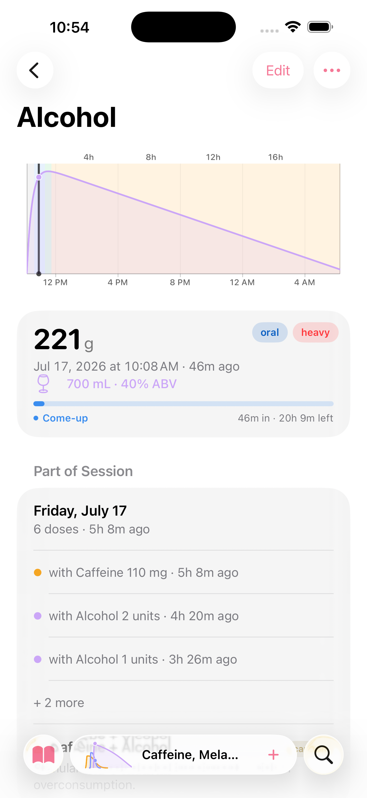 <b>100 kg</b> ・ 同一瓶，约 20 小时</td>
  </tr>
</table>

## 不只是一部日志

Piru 保留一份干净的账目——但把它只当作「剂量日志」，未免小看了它。这个把你的药代动力学画出来的
应用，同时也是一部用药追踪器、一台提醒引擎，以及一个药效学沙盒。这些都不是硬凑上去的。

<table>
  <tr>
    <td align="center">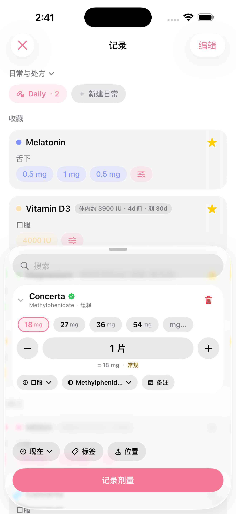 <b>记的是药片，不是毫克</b> ・ 选一个像 <b>Concerta</b> 的品牌，Piru 便列出它真实的片剂规格——18 / 27 / 36 / 54 mg——并按片计量</td>
    <td align="center">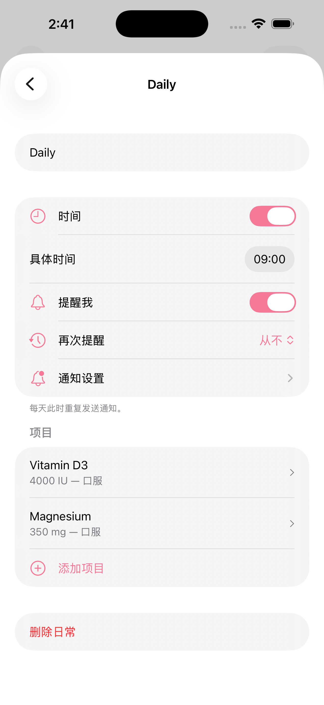 <b>处方与日常</b> ・ 把每天要吃的药归入一个日常，给它一个时间，提醒一到便打开已预填好的快捷记录——库存还会倒数到补货</td>
  </tr>
  <tr>
    <td align="center">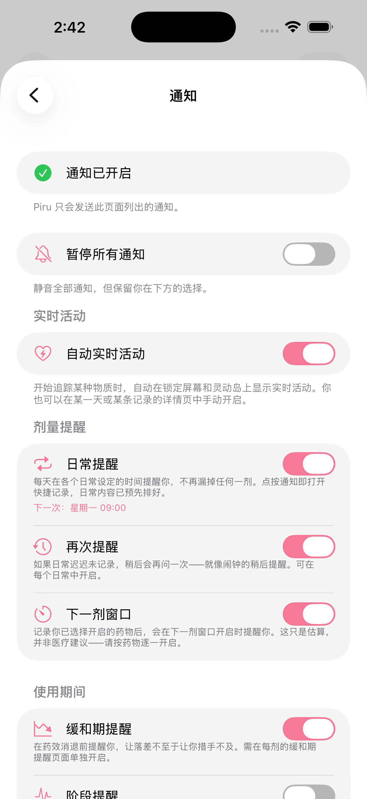 <b>贴合剂量的提醒</b> ・ 日常提醒、<i>再次提醒</i>的稍后一问、下一剂窗口，以及药效消退前的缓和期提醒——每一种都可单独开关，尽在一屏</td>
    <td align="center">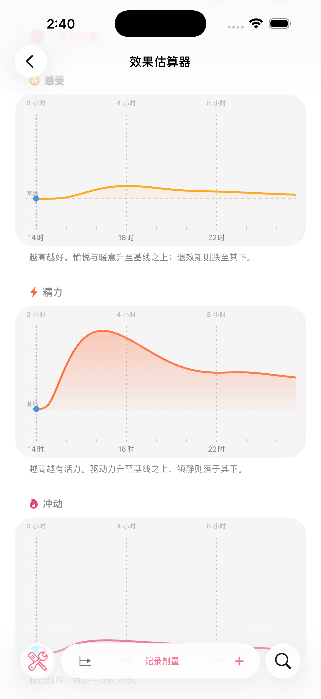 <b>效果估算器</b> ・ 一个假设沙盒——比较两种药物、或预览一份叠加，看它在这几个小时里可能<i>如何感受</i>，无需记录任何内容</td>
  </tr>
</table>

## 物质库 —— 1,700+ 种物质，条条有据

Piru 内置一个离线 SQLite 物质库，收录 **1,700+ 种物质**。每一个字段——一段剂量范围、一段时长、
一项受体亲和力、一段机制概述——都按**来源优先级**（顺序可由你调整）解析，并各自携带出处，
因此物质详情页的末尾会有一份 **数据来源** 列表，直接链接到各来源中该物质的页面。剂量与时长
优先取自 **[drug.community](https://drug.community)**——我们主要的剂量/时长数据集——其未覆盖的
字段再由志愿者维基补足。各字段按以下优先级决定采用哪个来源：

- **Piru 自己的手工整理层** 与 **同行评审的一手文献** —— 优先级最高，经核实的勘误始终胜出
  （上游确有的剂量错误也在这一层覆盖修正）
- **[drug.community](https://drug.community)** —— **首选**的剂量/时长阶梯与效应强度谱
- **[PsychonautWiki](https://psychonautwiki.org)** 与 **[TripSit](https://tripsit.me)** —— 补足剂量范围与
  时长，并提供效应词汇、相互作用数据与减害剂量
- **[FreeODwiki](https://github.com/SalviaSWC/FreeODwiki)** —— **中文语境**下的物质档案正文来源
- **[DailyMed](https://dailymed.nlm.nih.gov)**（FDA）与 **DEA Orange Book** —— 处方标签与管制分级
- **[PubChem](https://pubchem.ncbi.nlm.nih.gov)** 与 **[Wikidata](https://www.wikidata.org)** —— 标识符与化学信息
- **[PDSP Ki 数据库](https://pdsp.unc.edu)** —— 受体结合亲和力
- **Erowid PiHKAL/TiHKAL** 与其余一手文献补足剩余部分

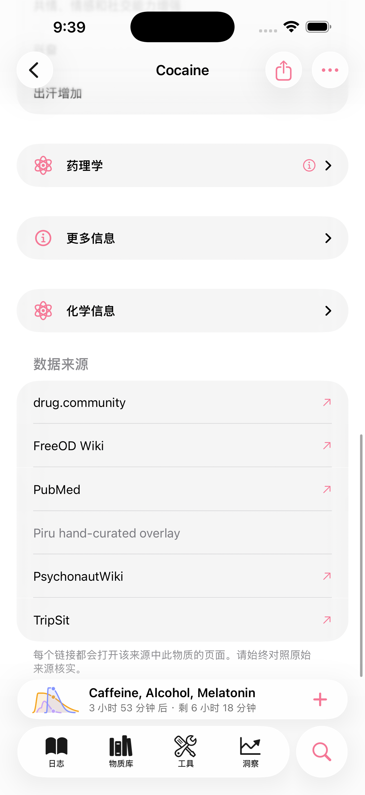

## 用你的语言阅读

Piru 提供 **英语、简体中文与繁體中文的完整本地化**——不只是界面框架，还包括药理概述、效应名称与
安全文案。危机求助资源**因地而异**：*获取帮助* 页面会显示你实际所在地区的紧急与危机热线。

<table>
  <tr>
    <td align="center">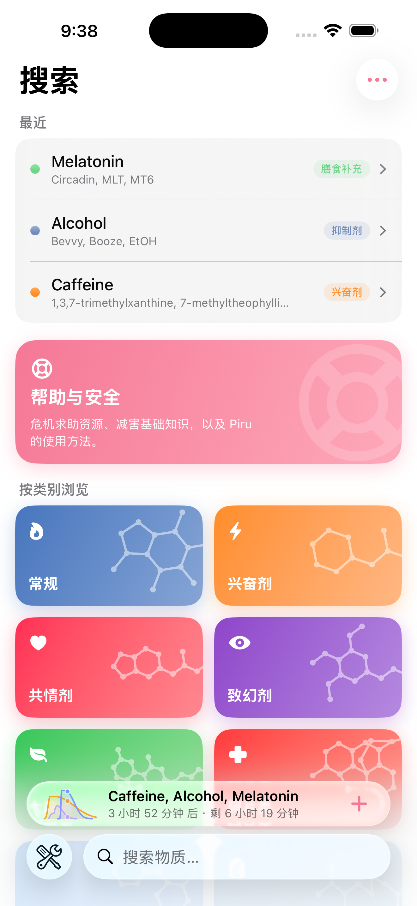 搜索 ・ 按类别浏览</td>
    <td align="center"> 获取帮助 ・ 因地而异的危机热线</td>
    <td align="center">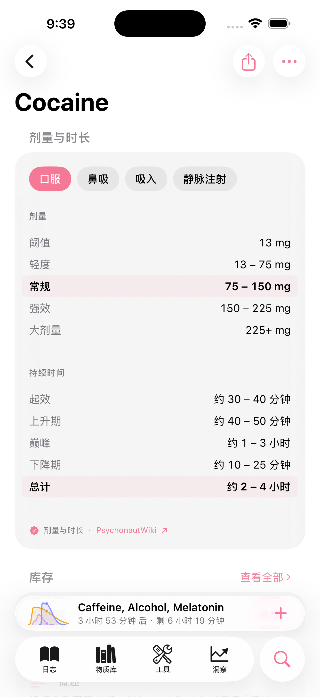 剂量与时长 ・ 阶梯与曲线，标注出处</td>
  </tr>
</table>

## 细看

<table>
  <tr>
    <td align="center">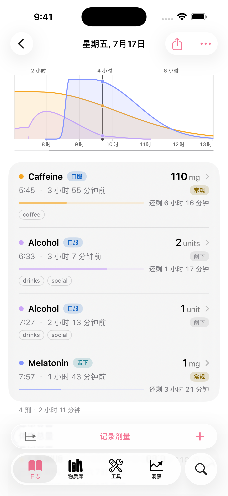 <b>会话详情</b> ・ 每一剂都在走针</td>
    <td align="center">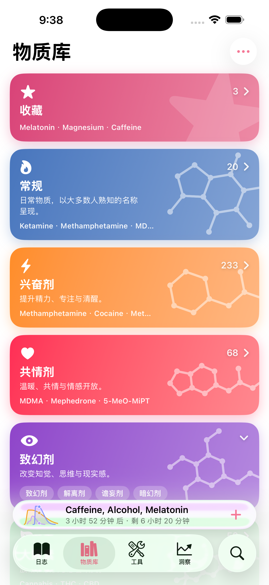 <b>物质库</b> ・ 按效应类别浏览</td>
    <td align="center">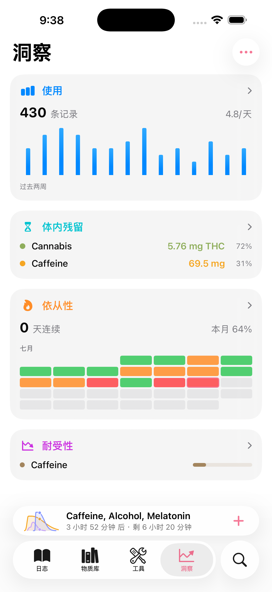 <b>洞察</b> ・ 使用、依从性、耐受性</td>
  </tr>
  <tr>
    <td align="center" colspan="3">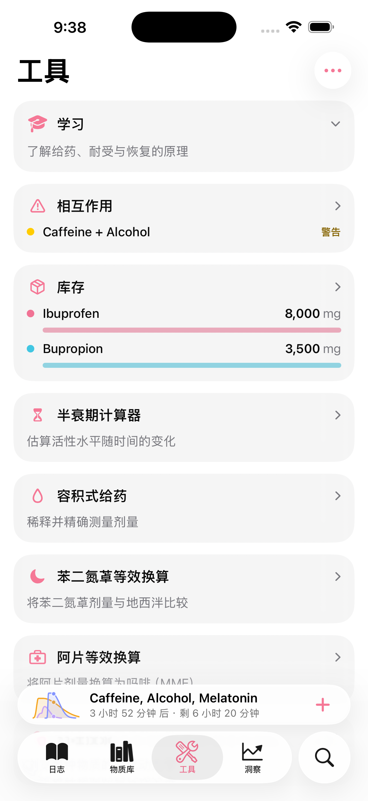 <b>工具</b> ・ 计算器、换算与库存</td>
  </tr>
</table>

## 隐私优先的设计

Piru 是为敏感数据打造的，因此默认就是最稳妥的那一种：**任何东西都不会离开你的设备。**

- **仅在本机。** 你的日志用 SwiftData 存在本地。无需注册、无账号、无服务器。
- **不主动上云。** 备份是可选的，并以**端到端加密**（AES-256-GCM）保护，密钥或来自你 iCloud
  钥匙串中的设备密钥，或来自只有你知道的口令。
- **无广告、无追踪、不倒卖分析。** 你的数据只属于你自己。

## 系统要求

- **iOS 26 或更高版本。** 界面围绕 Liquid Glass 打造；不支持更早的 iOS。
- 构建需 **Xcode 26+** 与 Swift 6——克隆后打开 `Piru.xcodeproj` 运行即可。
- 通过 [TestFlight](https://testflight.apple.com/join/4vcA7dY3) 分发，未上架 App Store —— 见 [下载测试版](#下载测试版)。

内置物质库由一条离线、可复现的 Python 流水线从已提交的来源快照构建——见 [`pipeline/`](pipeline/)。
切勿手工编辑 `Piru/Data/piru-substances.sqlite`；请用 `pipeline/build.sh` 重新构建。

## 关于名字

**Piru**（ピル）是日语中「药丸」的意思——微笑的胶囊即由此而来。名字与吉祥物承袭自本应用的原作者
[pharmacykitty](https://github.com/pharmacykitty)。它在 [kagerou.glass](https://kagerou.glass)
的处方架上占据一格——**rx no. 007**，你伸手取用、以记住自己摄入了什么的那一味。

## 许可证

Piru 是自由软件，遵循 **GNU 通用公共许可证 v3**——见 [LICENSE](LICENSE)。

## 致谢

最初由 [pharmacykitty](https://github.com/pharmacykitty) 打造；现由
[@kageroumado](https://x.com/kageroumado) 接续，在 [kagerou.glass](https://kagerou.glass) 配药。
药理数据承蒙 [FreeODwiki](https://github.com/SalviaSWC/FreeODwiki)、
[PsychonautWiki](https://psychonautwiki.org)、[TripSit](https://tripsit.me)、NIH 的
[DailyMed](https://dailymed.nlm.nih.gov)、[PubChem](https://pubchem.ncbi.nlm.nih.gov)、
[PDSP Ki 数据库](https://pdsp.unc.edu)，以及应用中各处引用的同行评审文献。

> **服用注意 ・ Piru 不构成医疗建议。** 它不会阻止你做出糟糕的决定，而且它的模型是估算，不是测量。
> 备好试剂盒、从低剂量开始、身边留一个清醒的朋友。♡
