# Where the data goes

*Generated by `pipeline/audit/data_usage.py --graph`. Do not edit.*

Each populated table, the sources that fill it, and the screen it is
declared to belong on. **Red** means nothing renders it. **Amber** means
the app reads it and drops part of it before rendering.

```mermaid
graph LR
    subgraph sources[Sources]
    src_benzos_cited("benzos-cited")
    src_drug_community("drug.community")
    src_erowid_pihkal("erowid-pihkal")
    src_erowid_tihkal("erowid-tihkal")
    src_freeodwiki("freeodwiki")
    src_medtap("medtap")
    src_peer_review_primary("peer-review-primary")
    src_piru_curated("piru-curated")
    src_psychonautwiki("psychonautwiki")
    src_pyrls("pyrls")
    src_tripsit("tripsit")
    src_wikidata("wikidata")
    end
    subjective_effects["subjective_effects<br/>23,511 rows"]
    durations["durations<br/>9,135 rows"]
    reported_effects["reported_effects<br/>8,321 rows"]
    tags["tags<br/>7,099 rows"]
    aliases["aliases<br/>5,396 rows"]
    effects["effects<br/>2,952 rows"]
    dose_ranges["dose_ranges<br/>2,498 rows"]
    citations["citations<br/>2,426 rows"]
    substance_forms["substance_forms<br/>1,800 rows"]
    substances["substances<br/>1,738 rows"]
    contraindications["contraindications<br/>1,656 rows"]
    categories["categories<br/>1,592 rows"]
    bindings["bindings<br/>1,307 rows"]
    indications["indications<br/>1,134 rows"]
    mechanisms_summary["mechanisms_summary<br/>986 rows"]
    molecule_shapes["molecule_shapes<br/>963 rows"]
    spectrum_levels["spectrum_levels<br/>954 rows"]
    substance_citations["substance_citations<br/>888 rows"]
    effect_vocab_labels["effect_vocab_labels<br/>789 rows"]
    descriptions["descriptions<br/>749 rows"]
    downstream_signalling["downstream_signalling<br/>690 rows"]
    substance_classes["substance_classes<br/>688 rows"]
    half_lives["half_lives<br/>687 rows"]
    metabolism["metabolism<br/>559 rows"]
    pk_routes["pk_routes<br/>435 rows"]
    tolerance["tolerance<br/>323 rows"]
    pharmacogenetics["pharmacogenetics<br/>305 rows"]
    class_citations["class_citations<br/>267 rows"]
    off_targets["off_targets<br/>209 rows"]
    drug_interactions_pk["drug_interactions_pk<br/>205 rows"]
    functional_assays["functional_assays<br/>179 rows"]
    protocol_dosing["protocol_dosing<br/>53 rows"]
    neuroimaging["neuroimaging<br/>52 rows"]
    class_contexts["class_contexts<br/>50 rows"]
    peptide_profiles["peptide_profiles<br/>44 rows"]
    class_reference_compounds["class_reference_compounds<br/>34 rows"]
    diazepam_equivalents["diazepam_equivalents<br/>33 rows"]
    product_strengths["product_strengths<br/>26 rows"]
    biased_agonism["biased_agonism<br/>23 rows"]
    concentration_effects["concentration_effects<br/>23 rows"]
    durations_of_action["durations_of_action<br/>21 rows"]
    interaction_rules["interaction_rules<br/>19 rows"]
    sources["sources<br/>17 rows"]
    receptor_oligomers["receptor_oligomers<br/>8 rows"]
    product_durations["product_durations<br/>6 rows"]
    subgraph screen[On screen]
    ui_chemistry(["chemistry"])
    ui_combinations(["combinations"])
    ui_contraindications(["contraindications"])
    ui_doseDuration(["doseDuration"])
    ui_drugClass(["drugClass"])
    ui_effects(["effects"])
    ui_identity(["identity"])
    ui_mechanism(["mechanism"])
    ui_medicalUses(["medicalUses"])
    ui_overview(["overview"])
    ui_pharmacokinetics(["pharmacokinetics"])
    ui_receptorLiterature(["receptorLiterature"])
    ui_sources(["sources"])
    end
    src_drug_community --> subjective_effects
    src_freeodwiki --> subjective_effects
    src_piru_curated --> subjective_effects
    subjective_effects --> ui_effects
    src_drug_community --> durations
    src_erowid_pihkal --> durations
    src_erowid_tihkal --> durations
    src_freeodwiki --> durations
    src_piru_curated --> durations
    src_psychonautwiki --> durations
    src_tripsit --> durations
    durations --> ui_doseDuration
    src_drug_community --> reported_effects
    reported_effects --> ui_effects
    src_drug_community --> tags
    src_erowid_pihkal --> tags
    src_erowid_tihkal --> tags
    src_peer_review_primary --> tags
    src_piru_curated --> tags
    src_psychonautwiki --> tags
    src_pyrls --> tags
    src_tripsit --> tags
    src_wikidata --> tags
    tags --> ui_identity
    src_drug_community --> aliases
    src_freeodwiki --> aliases
    src_medtap --> aliases
    src_peer_review_primary --> aliases
    src_piru_curated --> aliases
    src_psychonautwiki --> aliases
    src_pyrls --> aliases
    src_tripsit --> aliases
    src_wikidata --> aliases
    aliases --> ui_identity
    src_piru_curated --> effects
    src_tripsit --> effects
    effects --> ui_effects
    src_drug_community --> dose_ranges
    src_erowid_pihkal --> dose_ranges
    src_erowid_tihkal --> dose_ranges
    src_freeodwiki --> dose_ranges
    src_piru_curated --> dose_ranges
    src_psychonautwiki --> dose_ranges
    src_tripsit --> dose_ranges
    dose_ranges --> ui_doseDuration
    citations --> ui_sources
    substance_forms --> ui_identity
    substances --> ui_identity
    src_benzos_cited --> contraindications
    src_medtap --> contraindications
    src_pyrls --> contraindications
    contraindications --> ui_contraindications
    src_erowid_pihkal --> categories
    src_erowid_tihkal --> categories
    src_freeodwiki --> categories
    src_piru_curated --> categories
    src_psychonautwiki --> categories
    src_pyrls --> categories
    src_tripsit --> categories
    src_wikidata --> categories
    categories --> ui_identity
    src_peer_review_primary --> bindings
    src_piru_curated --> bindings
    bindings --> ui_receptorLiterature
    src_medtap --> indications
    src_pyrls --> indications
    indications --> ui_medicalUses
    src_freeodwiki --> mechanisms_summary
    src_medtap --> mechanisms_summary
    src_piru_curated --> mechanisms_summary
    src_pyrls --> mechanisms_summary
    mechanisms_summary --> ui_mechanism
    molecule_shapes --> ui_chemistry
    src_drug_community --> spectrum_levels
    spectrum_levels --> ui_effects
    substance_citations --> ui_sources
    effect_vocab_labels --> ui_effects
    src_benzos_cited --> descriptions
    src_freeodwiki --> descriptions
    src_piru_curated --> descriptions
    src_psychonautwiki --> descriptions
    descriptions --> ui_overview
    src_peer_review_primary --> downstream_signalling
    downstream_signalling --> ui_mechanism
    substance_classes --> ui_drugClass
    src_medtap --> half_lives
    src_peer_review_primary --> half_lives
    src_piru_curated --> half_lives
    src_tripsit --> half_lives
    half_lives --> ui_pharmacokinetics
    src_peer_review_primary --> metabolism
    metabolism --> ui_pharmacokinetics
    src_benzos_cited --> pk_routes
    src_medtap --> pk_routes
    src_peer_review_primary --> pk_routes
    pk_routes --> ui_pharmacokinetics
    src_benzos_cited --> tolerance
    src_peer_review_primary --> tolerance
    tolerance --> ui_pharmacokinetics
    src_peer_review_primary --> pharmacogenetics
    pharmacogenetics --> ui_pharmacokinetics
    class_citations --> ui_sources
    src_peer_review_primary --> off_targets
    off_targets --> ui_receptorLiterature
    src_peer_review_primary --> drug_interactions_pk
    drug_interactions_pk --> ui_combinations
    src_peer_review_primary --> functional_assays
    functional_assays --> ui_receptorLiterature
    src_piru_curated --> protocol_dosing
    protocol_dosing --> ui_doseDuration
    src_peer_review_primary --> neuroimaging
    neuroimaging --> ui_receptorLiterature
    src_peer_review_primary --> class_contexts
    class_contexts --> ui_drugClass
    src_piru_curated --> peptide_profiles
    peptide_profiles --> ui_medicalUses
    class_reference_compounds --> ui_receptorLiterature
    src_benzos_cited --> diazepam_equivalents
    diazepam_equivalents --> ui_doseDuration
    product_strengths --> ui_doseDuration
    src_peer_review_primary --> biased_agonism
    biased_agonism --> ui_receptorLiterature
    src_peer_review_primary --> concentration_effects
    concentration_effects --> ui_pharmacokinetics
    src_piru_curated --> durations_of_action
    durations_of_action --> ui_doseDuration
    src_tripsit --> interaction_rules
    interaction_rules --> ui_combinations
    sources --> ui_sources
    src_peer_review_primary --> receptor_oligomers
    receptor_oligomers --> ui_receptorLiterature
    product_durations --> ui_doseDuration
    classDef dead fill:#5b1a1a,stroke:#d06666,color:#fff;
    classDef partial fill:#5b451a,stroke:#d0a566,color:#fff;
    classDef live fill:#1a3d2b,stroke:#5fbf8f,color:#fff;
    class aliases,dose_ranges,citations,substance_forms,substances,bindings,mechanisms_summary,spectrum_levels,substance_citations,half_lives,metabolism,pk_routes,tolerance,pharmacogenetics,class_citations,off_targets,drug_interactions_pk,functional_assays,protocol_dosing,neuroimaging,class_contexts,peptide_profiles,diazepam_equivalents,product_strengths,biased_agonism,concentration_effects,durations_of_action,interaction_rules,sources,receptor_oligomers,product_durations partial;
    class subjective_effects,durations,reported_effects,tags,effects,contraindications,categories,indications,molecule_shapes,effect_vocab_labels,descriptions,downstream_signalling,substance_classes,class_reference_compounds live;
```

## Declared a home, not yet rendered

| rows | table | belongs on | why it matters |
|---:|---|---|---|
